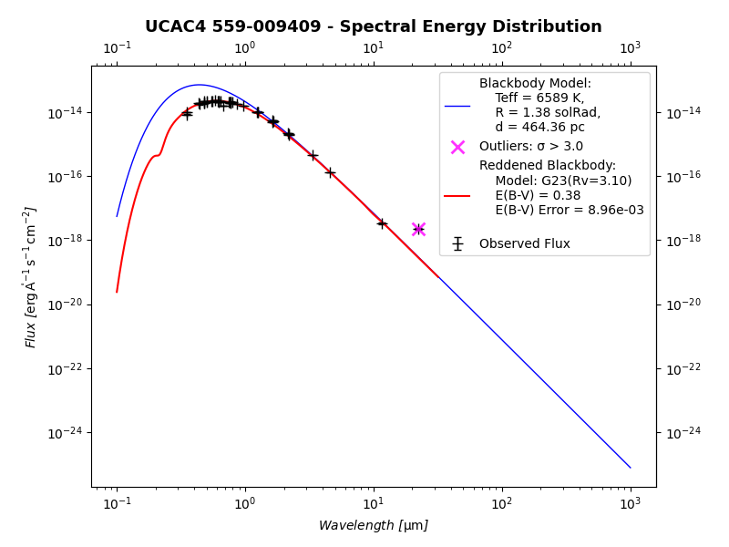
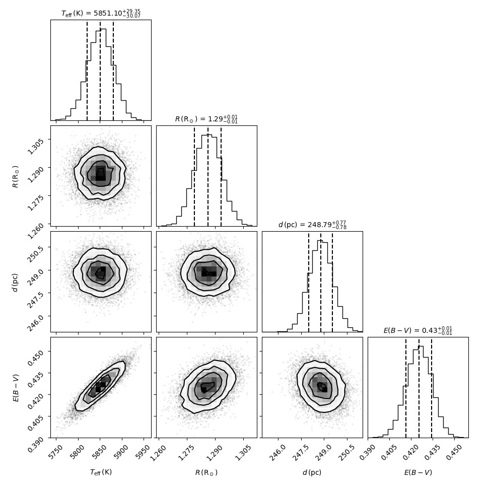
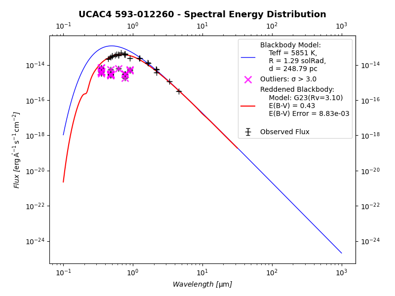

# sedlib

A Python library for Spectral Energy Distribution (SED) analysis of single stars.

[](https://pypi.org/project/sedlib/)
[](https://www.python.org/downloads/)
[](https://doi.org/10.1016/j.asr.2026.03.029)
[](https://opensource.org/licenses/Apache-2.0)
[](https://www.astropy.org/)

## Table of Contents

- [1. Overview](#1-overview)
- [2. Installation](#2-installation)
  - [2.1. Prerequisites](#21-prerequisites)
  - [2.2. Install from PyPI](#22-install-from-pypi)
  - [2.3. Install from source](#23-install-from-source)
  - [2.4. Dependencies](#24-dependencies)
- [3. Quick Start](#3-quick-start)
  - [3.1. Basic Usage](#31-basic-usage)
- [4. API Reference](#4-api-reference)
  - [4.1. SED Class](#41-sed-class)
    - [4.1.1. Parameters](#411-parameters)
    - [4.1.2. Key Methods](#412-key-methods)
    - [4.1.3. Attributes](#413-attributes)
  - [4.2. Catalog Class](#42-catalog-class)
    - [4.2.1. Key Methods](#421-key-methods)
  - [4.3. Filter Class](#43-filter-class)
    - [4.3.1. Parameters](#431-parameters)
    - [4.3.2. Key Methods](#432-key-methods)
  - [4.4. BolometricCorrection Class](#44-bolometriccorrection-class)
    - [4.4.1. Parameters](#441-parameters)
    - [4.4.2. Key Methods](#442-key-methods)
    - [4.4.3. Attributes](#443-attributes)
  - [4.5. Project Management](#45-project-management)
  - [4.6. Interactive Plotting](#46-interactive-plotting)
  - [4.7. Custom Analysis Pipeline](#47-custom-analysis-pipeline)
- [5. Examples](#5-examples)
  - [5.1. Complete Analysis Pipeline](#51-complete-analysis-pipeline)
- [6. Contributing](#6-contributing)
  - [6.1. Development Setup](#61-development-setup)
  - [6.2. Code Style](#62-code-style)
- [7. About](#7-about)
  - [7.1. License](#71-license)
  - [7.2. Citation](#72-citation)
  - [7.3. Acknowledgments](#73-acknowledgments)
- [8. Changelog](#8-changelog)
  - [8.1. Version 1.0.0](#81-version-100)
  - [8.2. Version 1.0.1](#82-version-101)

## 1. Overview

sedlib provides comprehensive tools for analyzing stellar spectral energy distributions, including:

- **Photometric data management** with the `Catalog` class
- **Filter handling** with the `Filter` class
- **SED analysis** with the `SED` class
- **Bolometric corrections** for accurate stellar radius determination
- **Advanced optimization** for interstellar extinction correction
- **Integration** with astronomical libraries like astropy and dust_extinction

## 2. Installation

### 2.1. Prerequisites

- Python 3.8 or higher
- pip package manager

### 2.2. Install from PyPI

The easiest way to install sedlib is directly from PyPI using pip:

```bash
pip install sedlib
```

To upgrade to the latest version:

```bash
pip install --upgrade sedlib
```

### 2.3. Install from source

For development or to access the latest unreleased features:

```bash
git clone https://github.com/ookuyan/sedlib.git
cd sedlib
pip install -e .
```

### 2.4. Dependencies

The library requires several scientific Python packages:

- `astropy` - Astronomical utilities
- `numpy` - Numerical computing
- `scipy` - Scientific computing
- `matplotlib` - Plotting
- `pandas` - Data manipulation
- `dust_extinction` - Extinction models
- `astroquery` - Astronomical data queries
- `bokeh` - Interactive plotting
- `corner` - Corner plots for MCMC results
- `joblib` - Parallel processing
- `dill` - Serialization
- `tqdm` - Progress bars
- `beautifulsoup4` - HTML parsing
- `requests` - HTTP requests

## 3. Quick Start

### 3.1. Basic Usage

```python
from sedlib import SED

# initialize the SED object
sed = SED(name='Gaia DR3 145538372736262912')

# run the complete analysis pipeline
sed.run()
```

```
================================================================================
SED ANALYSIS PIPELINE FOR: UCAC4 559-009409
================================================================================
🚀 Pipeline stages to be executed:
  1. 🧹 Data Cleaning
  2. 📊 Flux Combination
  3. 🔍 Outlier Filtering
  4. ⭕ Radius Estimation
  5. 🌫️ Extinction Estimation
  6. ✨ Bolometric Correction
  7. 💾 Save Project
--------------------------------------------------------------------------------
Initial parameters:
🔥 Temperature: 6588.9638671875 K
± Temperature error: 16.833251953125 K
⭕ Radius: 1.5003000497817993 solRad
± Radius error: 0.02544999122619629 solRad
📏 Distance: 464.364907135142 pc
± Distance error: 3.0629455414607314 pc
📊 Number of photometric measurements: 165
--------------------------------------------------------------------------------


🔄 STAGE 1/7: 🧹 Data Cleaning
   Starting data cleaning...
   Removed 3 rows with missing data in 'filter' column(s)
   Remaining data points: 162
✅ COMPLETED: Stage 1/7 - Data Cleaning in 0.00s

🔄 STAGE 2/7: 📊 Flux Combination
   Starting flux combination...
   Combined flux measurements using 'median' method
   Combined 123 measurements
   Unique filters after combination: 39
✅ COMPLETED: Stage 2/7 - Flux Combination in 0.04s

🔄 STAGE 3/7: 🔍 Outlier Filtering
   Starting outlier filtering...
   Identified 1 outliers with sigma > 3.0
   Remaining valid measurements: 38
   Outliers are marked but not removed from the dataset
✅ COMPLETED: Stage 3/7 - Outlier Filtering in 0.01s

🔄 STAGE 4/7: ⭕ Radius Estimation
   Starting radius estimation...
   Using mc method for radius estimation
   Running with 1000 Monte Carlo samples
MC Sampling: 100%|██████████████████████████████████| 1000/1000 [00:11<00:00, 89.61it/s]
   --------- RADIUS ESTIMATION RESULTS ---------
   Radius: 1.3805923531705158 solRad
   Uncertainty: 0.009412372349938383 solRad
   Method: mc
   Valid samples: 1000
   --------------------------------------------
✅ COMPLETED: Stage 4/7 - Radius Estimation in 11.54s

🔄 STAGE 5/7: 🌫️ Extinction Estimation
   Starting extinction estimation...
   Using mc method for extinction estimation
   Extinction model: G23
   Running with 1000 Monte Carlo samples
Batch 1/10: 100%|█████████████████████████████████████| 100/100 [00:03<00:00, 32.19it/s]
Batch 2/10: 100%|█████████████████████████████████████| 100/100 [00:03<00:00, 32.12it/s]
Batch 3/10: 100%|█████████████████████████████████████| 100/100 [00:03<00:00, 32.13it/s]
Batch 4/10: 100%|█████████████████████████████████████| 100/100 [00:03<00:00, 31.97it/s]
Batch 5/10: 100%|█████████████████████████████████████| 100/100 [00:03<00:00, 31.22it/s]
Batch 6/10: 100%|█████████████████████████████████████| 100/100 [00:03<00:00, 32.16it/s]
Batch 7/10: 100%|█████████████████████████████████████| 100/100 [00:03<00:00, 32.25it/s]
Batch 8/10: 100%|█████████████████████████████████████| 100/100 [00:03<00:00, 32.58it/s]
Batch 9/10: 100%|█████████████████████████████████████| 100/100 [00:03<00:00, 31.30it/s]
Batch 10/10: 100%|████████████████████████████████████| 100/100 [00:03<00:00, 31.98it/s]
   -------- EXTINCTION ESTIMATION RESULTS --------
   E(B-V): 0.3760
   Uncertainty: 0.0087
   Method: mc
   Valid samples: 1000
   -----------------------------------------------
✅ COMPLETED: Stage 5/7 - Extinction Estimation in 32.36s

🔄 STAGE 6/7: ✨ Bolometric Correction
   Starting bolometric correction...
   Computing extinction (A_λ) for each filter
   Computing absolute magnitudes
   Running bolometric correction
   Accept radius correction: True
   -------- BOLOMETRIC CORRECTION RESULTS --------
   Bolometric radius: 1.3815522981780102 solRad
   Bolometric radius error: 0.03654157830727994 solRad
   -----------------------------------------------
✅ COMPLETED: Stage 6/7 - Bolometric Correction in 0.81s

🔄 STAGE 7/7: 💾 Save Project
   Starting save project...
   Saving SED project to 'sedlib/tmp/20251007222842-Gaia_DR3_145538372736262912.sed.zip'
✅ COMPLETED: Stage 7/7 - Save Project in 0.82s

================================================================================
PIPELINE SUMMARY
================================================================================
Stages completed: 7/7
Total execution time: 45.59 seconds

Stage Status:
  ✅ Data Cleaning: SUCCESS
  ✅ Flux Combination: SUCCESS
  ✅ Outlier Filtering: SUCCESS
  ✅ Radius Estimation: SUCCESS
  ✅ Extinction Estimation: SUCCESS
  ✅ Bolometric Correction: SUCCESS
  ✅ Save Project: SUCCESS

Final Results:
  Radius: 1.3815522981780102 solRad ± 0.03654157830727994 solRad
  E(B-V): 0.3760 ± 0.0087

SED project saved to: sedlib/tmp/20251007222842-Gaia_DR3_145538372736262912.sed.zip
================================================================================
```

```python
sed.plot(with_blackbody=True, with_extinction=True, with_outliers=True, show=True)
```




## 4. API Reference

### 4.1. SED Class

The main class for Spectral Energy Distribution analysis.

#### 4.1.1. Parameters

- `name` (str, optional): Name of the astronomical object
- `ra` (str or float, optional): Right ascension
- `dec` (str or float, optional): Declination
- `search_radius` (Quantity, optional): Search radius for queries (default: 1 arcsec)
- `coord` (SkyCoord, optional): Object coordinates
- `frame` (str, optional): Reference frame (default: 'icrs')
- `auto_search` (bool, optional): Auto-search on initialization (default: True)
- `cache` (bool, optional): Enable caching (default: True)
- `timeout` (int, optional): Query timeout in seconds (default: 10)
- `find_basic_parameters` (bool, optional): Find basic parameters from catalogs (default: True)
- `info` (bool, optional): Print summary info (default: True)

#### 4.1.2. Key Methods

- `add_photometry(filter_name, mag, mag_error=None)`: Add photometric data
- `filter_outliers(sigma_threshold=3.0)`: Filter outliers using sigma clipping
- `estimate_radius(accept=False)`: Estimate stellar radius
- `estimate_ebv()`: Estimate interstellar extinction
- `compute_A_lambda()`: Compute extinction at each wavelength
- `compute_absolute_magnitudes()`: Convert to absolute magnitudes
- `plot(with_blackbody=False, with_extinction=False, interactive=False)`: Plot SED
- `save(path, compression=True)`: Save SED project
- `load(path)`: Load saved SED project (class method)
- `run()`: Run complete analysis pipeline

#### 4.1.3. Attributes

- `name`: Object name
- `ra`, `dec`: Coordinates
- `coord`: SkyCoord object
- `parallax`, `parallax_error`: Parallax measurements
- `distance`, `distance_error`: Distance measurements
- `radius`, `radius_error`: Stellar radius
- `teff`, `teff_error`: Effective temperature
- `ebv`, `ebv_error`: Interstellar extinction
- `ext_model`: Extinction model
- `catalog`: Photometric catalog

### 4.2. Catalog Class

Manages photometric data in an Astropy Table format.

#### 4.2.1. Key Methods

- `delete_missing_data_rows(columns)`: Remove rows with missing data
- `delete_rows(conditions)`: Remove rows matching conditions
- `combine_fluxes(method='mean', overwrite=False)`: Combine duplicate filter measurements
- `filter_outliers(sigma_threshold=3.0)`: Apply sigma clipping
- `sql_query(query)`: Execute SQL queries on the catalog

### 4.3. Filter Class

Handles astronomical filter transmission curves from the SVO Filter Profile Service.

> **📖 For comprehensive Filter class documentation, examples, and advanced usage, visit: [https://github.com/ookuyan/filter](https://github.com/ookuyan/filter)**

#### 4.3.1. Parameters

- `name` (str, optional): Filter identifier (SVO format)
- `method` (str): Interpolation method ('linear' or 'nearest')
- `bounds_error` (bool): Raise errors for out-of-bounds values
- `fill_value` (float or None): Value for out-of-bounds interpolation
- `cache` (bool): Enable caching
- `timeout` (int): Request timeout

#### 4.3.2. Key Methods

- `from_svo(name)`: Load filter from SVO service
- `from_data(name, wavelength, transmission)`: Create filter from custom data
- `search(name, case=False)`: Search filter catalog
- `apply(wavelength, flux, error)`: Apply filter to spectrum
- `plot()`: Plot transmission curve

### 4.4. BolometricCorrection Class

Computes bolometric corrections and stellar radii based on effective temperature. The class implements the methodology from [Eker & Bakış (2023, MNRAS)](https://arxiv.org/abs/2305.12538), using fourth-degree polynomial fits for various photometric filters (Johnson B, V; GAIA G, GBP, GRP; TESS). Bolometric magnitudes are computed by applying filter-specific corrections to absolute magnitudes and combining them via inverse-variance weighting to derive stellar radii.

#### 4.4.1. Parameters

- `sed` (SED object): SED object with absolute magnitudes and effective temperature
- `coeff_file` (str, optional): Path to coefficient file
- `accept_radius` (bool): Store computed radius in sed object (default: False)

#### 4.4.2. Key Methods

- `run(verbose=False)`: Execute complete bolometric correction pipeline
- `compute_bolometric_corrections()`: Compute BCs for available filters
- `compute_weighted_abs_bol_mag()`: Compute weighted bolometric magnitude
- `compute_normalized_radius()`: Compute stellar radius in solar units

#### 4.4.3. Attributes

- `abs_bol_mag`, `abs_bol_mag_err`: Weighted bolometric magnitude and uncertainty
- `radius`, `radius_error`: Stellar radius in solar units and uncertainty

### 4.5. Project Management

The `save()` and `load()` methods provide a convenient way to preserve your entire SED analysis in a single file. When you save an SED project, the library uses dill serialization to bundle everything together—all stellar parameters, photometric data, analysis results, extinction estimates, and even the processing history. This means you can stop your work at any point and pick up exactly where you left off later, without needing to rerun time-consuming calculations like Monte Carlo simulations. This feature makes it easy to share your analysis with collaborators or archive results for future reference, ensuring reproducibility since the entire state of your analysis is preserved in one portable file. Optional zip compression is available for situations where file size matters, such as when sending analysis results as email attachments.

```python
# Save complete analysis
sed.save('sed_analysis.sedlib')

# Load saved project
loaded_sed = SED.load('sed_analysis.sedlib')

# Access results
print(f"Radius: {loaded_sed.radius:.2f} ± {loaded_sed.radius_error:.2f}")
print(f"E(B-V): {loaded_sed.ebv:.3f} ± {loaded_sed.ebv_error:.3f}")
```

```
Radius: 1.29 solRad ± 0.04 solRad
E(B-V): 0.425 ± 0.009
```

### 4.6. Interactive Plotting

Create interactive plots with Bokeh:

```python
# Interactive SED plot
sed.plot(
    with_blackbody=True,
    with_extinction=True,
    with_outliers=True,
    interactive=True
)
```

### 4.7. Custom Analysis Pipeline

```python
# Define custom pipeline configuration
config = {
    'data_cleaning': {
        'delete_missing_data_columns': ['filter', 'eflux'],
        'combine_fluxes': True,
        'filter_outliers': True,
        'sigma_threshold': 3.0
    },
    'radius_estimation': {
        'enabled': True,
        'method': 'monte_carlo',
        'n_samples': 1000
    },
    'extinction_estimation': {
        'enabled': True,
        'method': 'monte_carlo',
        'n_samples': 1000
    }
}

# Run custom pipeline
sed.run(custom_config=config)
```


## 5. Examples

### 5.1. Complete Analysis Pipeline

```python
from sedlib import SED, BolometricCorrection
from astropy import units as u

# Initialize SED object
sed = SED(name='Gaia DR3 164561603226850304')

# Set stellar parameters (from gaia)
sed.teff = 5850.74 * u.K
sed.teff_error = 29.62 * u.K

sed.radius = 1.4948 * u.solRad
sed.radius_error = 0.00840002 * u.solRad

sed.distance = 248.791 * u.pc
sed.distance_error = 0.772802 * u.pc

# Data cleaning
sed.catalog.filter_outliers(sigma_threshold=3.0, over_write=True)
sed.catalog.delete_missing_data_rows(['filter', 'eflux'])
sed.catalog.combine_fluxes(method='mean', overwrite=True)

# Radius estimation with Monte Carlo sampling
sed.estimate_radius(method='mc', n_samples=10000, accept=True)
```

```python
{'method': 'mc',
 'n_samples': 10000,
 'elapsed_time': 64.39362096786499,
 'radius_mean': <Quantity 1.28601477 solRad>,
 'radius_median': <Quantity 1.28599561 solRad>,
 'radius_std': <Quantity 0.00709151 solRad>,
 'success': True}
```

```python
# Extinction estimation with Monte Carlo sampling
sed.estimate_ebv(method='mc', n_samples=10000, accept=True)
```

```python
{'ebv_mean': np.float64(0.4253809724895975),
 'ebv_std': np.float64(0.008834504561834948),
 'ebv_median': np.float64(0.4255177019864373),
 'method': 'mc',
 'num_samples': 10000,
 'num_valid_samples': 10000,
 'elapsed_time': 167.62379121780396,
 'success': True}
```

```python
# Plot E(B-V) Monte Carlo results
sed.plot_results(ebv_mc=True)
```



```python
# Compute extinction and absolute magnitudes
sed.compute_A_lambda()
sed.compute_absolute_magnitudes()

# Bolometric correction
bc = BolometricCorrection(sed, accept_radius=True)
bc.run()

# Visualization
sed.plot(with_blackbody=True, with_extinction=True, with_outliers=True, show=True)
```



## 6. Contributing

Contributions are welcome! Please feel free to submit a Pull Request.

### 6.1. Development Setup

1. Fork the repository
2. Clone your fork: `git clone https://github.com/yourusername/sedlib.git`
3. Install in development mode: `pip install -e .`
4. Install development dependencies: `pip install -r requirements.txt`

### 6.2. Code Style

The project follows PEP 8 style guidelines. Please ensure your code is properly formatted.

## 7. About

### 7.1. License

This project is licensed under the Apache License 2.0 - see the [LICENSE](LICENSE) file for details.

### 7.2. Citation

If you use sedlib in your research, please cite:

```bibtex
@ARTICLE{2026AdSpR..77.9868O,
       author = {{Okuyan}, O{\u{g}}uzhan and {Bak{\i}{\textcommabelow s}}, Volkan and {Eker}, Zeki},
        title = "{Determining accurate radii and luminosities using multiband BC for LAMOST stars within 500 pc}",
      journal = {Advances in Space Research},
     keywords = {Stars: fundamental parameters, Stars: masses, Stars: radii, Methods: data analysis},
         year = 2026,
        month = may,
       volume = {77},
       number = {9},
        pages = {9868-9882},
          doi = {10.1016/j.asr.2026.03.029},
       adsurl = {https://ui.adsabs.harvard.edu/abs/2026AdSpR..77.9868O},
      adsnote = {Provided by the SAO/NASA Astrophysics Data System}
}
```

Software citation:

[](https://doi.org/10.5281/zenodo.17332608)

```bibtex
@software{sedlib_zenodo,
  author       = {Oğuzhan OKUYAN},
  title        = {sedlib: A Python library for Spectral Energy Distribution analysis},
  year         = {2024},
  publisher    = {Zenodo},
  version      = {[VERSION]},
  doi          = {10.5281/zenodo.17332608},
  url          = {https://doi.org/10.5281/zenodo.17332608}
}
```

Or cite the GitHub repository:

```bibtex
@software{sedlib2024,
  author = {Oğuzhan OKUYAN},
  title = {sedlib: A Python library for Spectral Energy Distribution analysis},
  year = {2024},
  url = {https://github.com/ookuyan/sedlib},
  version = {1.0.1}
}
```

### 7.3. Acknowledgments

- The SVO Filter Profile Service for providing filter transmission curves
- The Astropy community for excellent astronomical tools
- The dust_extinction package for extinction models
- The VizieR service for photometric data access

## 8. Changelog

### 8.1. Version 1.0.0
- Initial release
- Complete SED analysis pipeline
- Filter management via SVO service
- Bolometric correction calculations
- Monte Carlo uncertainty estimation
- Interactive plotting capabilities
- Project save/load functionality

### 8.2. Version 1.0.1
- Bug fixes
